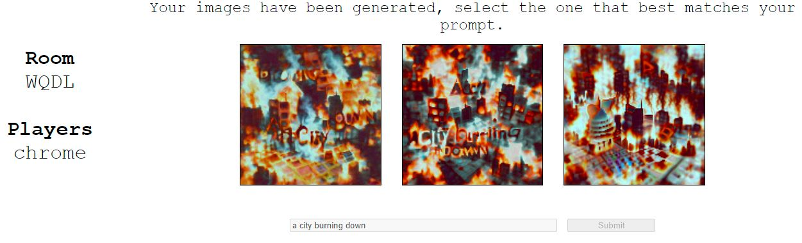
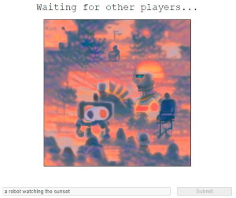

# Deep Daze Pictionary

Play at https://pictionary.pbatch.net/.

Welcome to Deep Daze Pictionary, a combination of image synthesis and telephone pictionary.



This is a fun game played in groups which proceeds as follows:

1) Each player writes down a prompt I.e. "A robot watching the sunset", and has 3 images generated for them. 
This currently takes about 60 seconds per player (given that no-one else is on the website).


2) Each player selects the image that best matches their prompt.



3) All the images are passed on, and now each player must write a prompt that matches the image (step 1)

[city_single](./pictures/a_city_burning_down_single.jpg)

Once everyone has seen your original image, 
the game ends, 
and you can see how your image developed over time.

[robot_final](./pictures/a_robot_watching_the_sunset_final.jpg)

IMPORTANT! If the website breaks while you are playing,
 perform a hard reset by deleting the local storage.

## Credits

Thanks to [Phil Wang](https://github.com/lucidrains) for creating the [Deep Daze](https://github.com/lucidrains/deep-daze) repository,
and to [Ryan Murdock](https://twitter.com/advadnoun) for the discovery of the technique itself.

## TODOS

* Add comments to the code...
* Fix design for different screen sizes
* Connect Redux state with Amplify
* Fix duplicate requests to create item in DynamoDB
* Fix regex in game.js to not use look behind (doesn't work in Safari)
* Can change the resolver for listMessages so that a filter can be added
* Can make the S3 URL checks a graphQL subscription (instead of pinging from Lambda) 

## Possible improvements

* Faster convergence of the SIREN network
* Cheaper/faster infrastructure (the current version of the website costs about 50p/h)
* The ability to use a custom seed image
* Test other image synthesis methods (VQ-GAN...)
* Whatever you guys put in issues... :)
 
## Deploying your own version of the website

0.) Install AWS CDK and AWS ClI

1.) Make a private ECR repository

2.) Follow the commands in the ECR repository to upload the Docker image

3.) Set the global variables in `backend/pictionary/pictionary_stack.py`

4.) Deploy the CloudFormation stack

```
cdk deploy --outputs-file "../frontend/src/constants/cdk.json"
```

5.) Start the server

```
python server.py
```

## Contact

If you have any questions, queries or concerns I would love to hear from you.

Please email me at peter_batchelor1@hotmail.com.