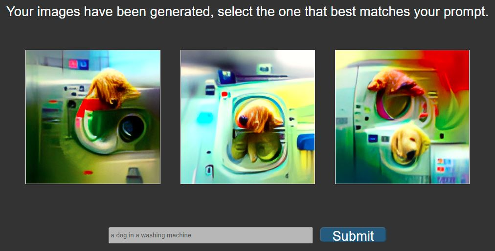
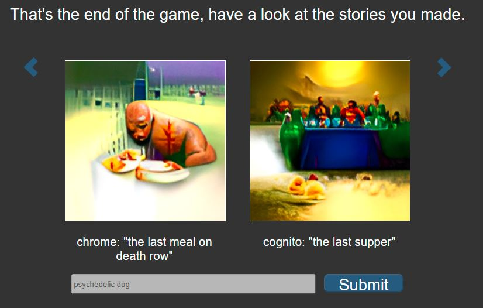

# Pete-tionary

Play at https://pictionary.pbatch.net/.

Welcome to Pete-tionary, a combination of image synthesis and telephone pictionary.


This is a fun game played in groups which proceeds as follows:

---

Each player writes down a prompt.



---

Each player selects the image that best matches their prompt.


---

Each player passes their image on and receives a new image from another player.


---

Each player must then try to write a prompt that generates a similar image.
The game continues in this fashion until each player has seen each initial image once.


---

Once the game ends, you can scroll through the stories you have made.




---

IMPORTANT! If the website breaks while you are playing,
 perform a hard reset by deleting the local storage.

## Credits

Thanks to [Jens Goldberg](https://https://twitter.com/aransentin) for creating the Direct Visions notebook.

Thanks to [Phil Wang](https://github.com/lucidrains) for creating the [Deep Daze](https://github.com/lucidrains/deep-daze) repository,
and to [Ryan Murdock](https://twitter.com/advadnoun) for the discovery of the technique itself.

## TODOS

* Connect Redux state with Amplify
* Make the S3 URL checks a graphQL subscription (instead of pinging from Lambda) 
* Add the current queue size to the waiting screen
* Use a GAN to create high-resolution outputs
* Run the server from inside Google Colab to save money
 
## Deploying your own version of the website

0) Install AWS CDK and the AWS CLI

1) Make a private ECR repository

2) Follow the commands in the ECR repository to upload the Docker image

3) Set the global variables in `backend/pictionary/pictionary_stack.py`

4) Deploy the CloudFormation stack (run this command in `backend`)

    ```
    cdk deploy --outputs-file "../frontend/src/constants/cdk.json"
    ```

5) Build the website (run this command in `frontend`)

    ```
    npm run build
    ```

6) Deploy the CloudFormation stack again (See step 4)

7) Start the server

    ```
    python server.py
    ```

## Contact

If you have any questions, queries or concerns I would love to hear from you.

Please email me at peter_batchelor1@hotmail.com.